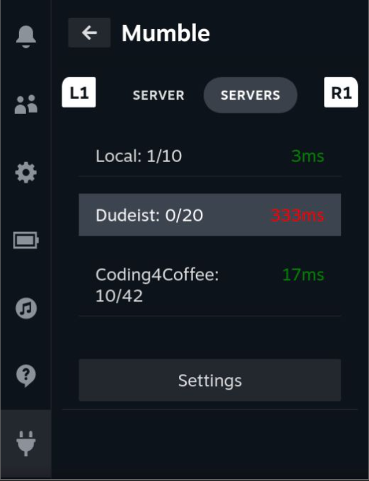

# Mumble Steam Deck Plugin

This repository is an attempt to create a Mumble VOIP client built into the Steam Deck interface. It is a work in progress and is absolutely not guarunteed to be free of bugs. Don't browse the code if you're offendded by profanity until I actually start polishing it.

Uses Pymumble in the backend for handling the connection.

Why do we want a Mumble plugin for the Steam Deck?

One can already use the full Mumble client by launching it as a game in Steam, but this is a bit un-intuitive at the moment with the Steam Deck. This plugin aims to make it easier to join your favorite Mumble servers and chat without too much hassle by being built into the Steam Deck Big Picture interface. 

This was just an idea I had which made for a great project to hone my Python skills, and to learn Typescript / React. 
While this plugin is very experimental, I've got it to a point where it actually functions as a working, yet minimalistic Mumble client. 

Shoutout to [ILadis](https://github.com/ILadis) who starred this repo, but also happens to have a [TeamSpeak Deck plugin](https://github.com/ILadis/ts3-qs4sd) which was super useful to me when troubleshooting how to get inputs from the Deck controls. Vielen Dank!

## Features:
- 3 different voice transmit modes: always-on, voice activity, push-to-talk (Kind of works*)
- Save servers and connect from the server manager
- Select any Input or Output devices for audio
- Text chat to channels and privately to other users
- Navigate Channels
- Local volume adjustment for each user
- View and Set user comments
- Show server info
- Access token support, with ability to kick users
- Basic public server browser

### To do:
- Rest of the admin related functions
- Show user info and Server certificate chain info
- Audio quality customization, input compression customization
- Recording
- Make the interface generally less shitty. Add some nice icons etc.
- Remove all the profanity and nonsense from the code. It's just how I keep things interesting...
- Enhance push-to-talk

- Networking options such as proxies, force TCP, reconnecting on disconnect etc.
- Configuration to enable notifications (toasts) for events
- Manage certificates
- Anything and everything else I can think of
- Find a way to package it without requiring the user to run pip install numpy
- Think of a good name for it

### To install:
Now that I have a .zip file release, you can install this plugin if you enable Decky Loader Developer mode. The only other pre-requisite is that numpy is installed via pip, since numpy doesn't play nice when trying to package up for distribution.

##### The pre-requisites are:
-  A Steam Deck with Decky Loader installed
-  numpy installed on the Steam Deck

On your Steam Deck:
1. Install [Decky Loader](https://github.com/SteamDeckHomebrew/decky-loader)
2. Make sure pip is installed: `python -m ensurepip`
3. You need to install numpy to your Steam Deck. Open a terminal and run: `python -m pip install numpy`
4. Download the .zip release and install it via Decky Loader Developer menu
5. Restart Steam Deck
6. Enjoy!

### To build:

 Make sure to read up on how the [Decky Template Repository](https://github.com/SteamDeckHomebrew/decky-plugin-template) is organized. 
 I am assuming you are using a GNU/Linux based OS with a bash terminal. I have no idea how to build this on Windows or Mac, but if you're determined enough, you can figure it out.

Build machine pre-requisites are:
 -  Your build machine needs [pnpm](https://pnpm.io/installation) and Python3 with pip installed:
    - Arch Linux: `sudo pacman -S pnpm python pip`
    - Debian / Ubuntu:
        - `sudo apt install python3 python3-pip`
        - `curl -fsSL https://get.pnpm.io/install.sh | sh -`

On the build machine:
1. Clone this repo and cd: `git clone git@github.com:manbearpig3130/deckyble.git && cd deckyble`
2. To install required Typescript packages, run: `pnpm i`
3. Python dependencies are installed to py_modules by running: `pip install -r requirements.txt --target py_modules/`
4. Create a symbolic link for py_modules: `ln -s py_modules/ defaults/py_modules`
5. Edit the .env file with the SSH connection details to your Steam Deck. A ~/.ssh/config file with your Steam Deck configured is helpful.
6. Run `make it` to build and install to your Steam Deck
7. It works maybe?

### Notes:

* Push-To-Talk is a bit broken because of how Steam takes exclusive control of the Steam Deck Controller. When enabling a PTT button in the SteamOS interface, some buttons and joysticks will stop working until PTT is disabled again.
* While in-game it should be possible to get button presses from the virtual gamepad, assuming they have been mapped in the Steam Input options. I'm yet to implement this.
* I know the interface is a bit janky. I basically learned Typescript making this plugin.
* If you join a server with heaps of channels and users, the experience will probably be a bit shit at the moment.
* It might help to set your microphone in Steam settings to "Microphone" instead of "Default"

## Images:

### Connected to a server:

### Server Browser:

### Chat Window:

### Chat Tab:

### Server Settings:

### Sound Settings:

### Server Info:

