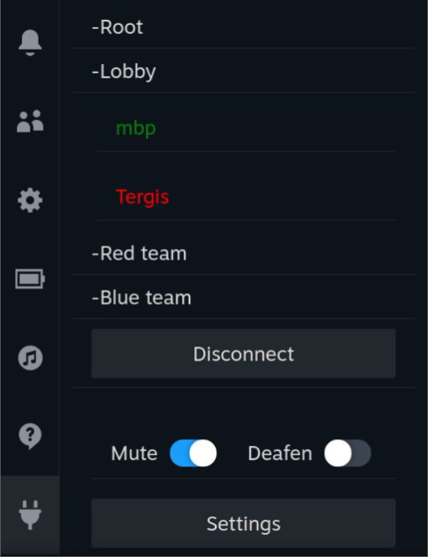
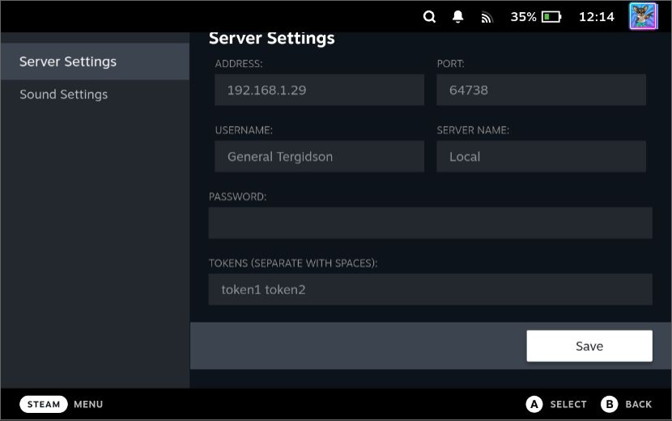
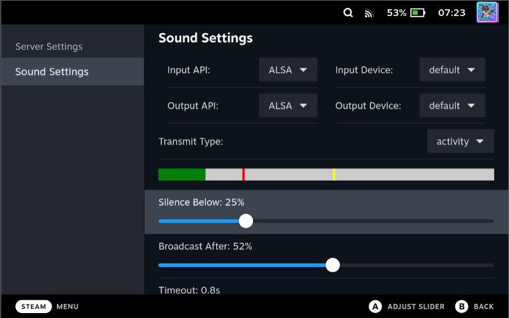

# Mumble Steam Deck Plugin

This repository is an attempt to create a Mumble VOIP client built into the Steam Deck interface. It is a work in progress and is absolutely not guarunteed to be free of bugs or to even work at all. Don't browse the code if you're offendded by profanity until I actually start polishing it.

Pymumble is used in the Python backend to handle Mumble connections.

## Features:
- 3 different voice transmit modes: always-on, voice activity. push-to-talk (Kind of works*)
- Save servers and connect from the server manager
- Select any Input or Output devices for audio
- Text chat to channels and privately to other users
- Navigate Channels

### To install:

 Make sure to read up on how the [Decky Template Repository](https://github.com/SteamDeckHomebrew/decky-plugin-template) is organized. 
 I am assuming you are using a GNU/Linux based OS with a bash terminal. I have no idea how to build this on Windows or Mac, but if you're determined enough, you can figure it out.

The pre-requisites for this to work are:
-  A Steam Deck with Decky Loader installed
-  numpy installed on the Steam Deck
-  Your build machine needs [pnpm](https://pnpm.io/installation) and Python3 with pip installed:
    - Arch Linux: `sudo pacman -S pnpm python pip`
    - Debian / Ubuntu:
        - `sudo apt install python3 python3-pip`
        - `curl -fsSL https://get.pnpm.io/install.sh | sh -`

On your Steam Deck:
1. Install [Decky Loader](https://github.com/SteamDeckHomebrew/decky-loader)
2. You need to install numpy to your Steam Deck: `python -m pip install numpy`

On the build machine:
1. Clone this repo and cd: `git clone git@github.com:manbearpig3130/deckyble.git && cd deckyble`
2. To install required Typescript packages, run: `pnpm i`
3. Python dependencies are installed to py_modules by running: `pip install -r requirements.txt --target py_modules/`
4. Create a symbolic link for py_modules: `ln -s py_modules/ defaults/py_modules`
5. Edit the .env file with the SSH connection details to your Steam Deck. A ~/.ssh/config file with your Steam Deck configured is helpful.
6. Run `make it` to build and install to your Steam Deck
7. It works maybe?

### Notes:

* Push-To-Talk is a bit broken because of how Steam takes exclusive control of the Steam Deck Controller. When enabling a PTT button in the SteamOS interface, some buttons and joysticks will stop working until PTT is disabled again.
* While in-game it should be possible to get button presses from the virtual gamepad, assuming they have been mapped in the Steam Input options. I'm yet to implement this.
* I know the interface is a bit janky. I basically learned Typescript making this plugin.

## Images:

### Connected to a server:

### Server Browser:

### Chat Window:

### Chat Tab:

### Server Settings:

### Sound Settings:

